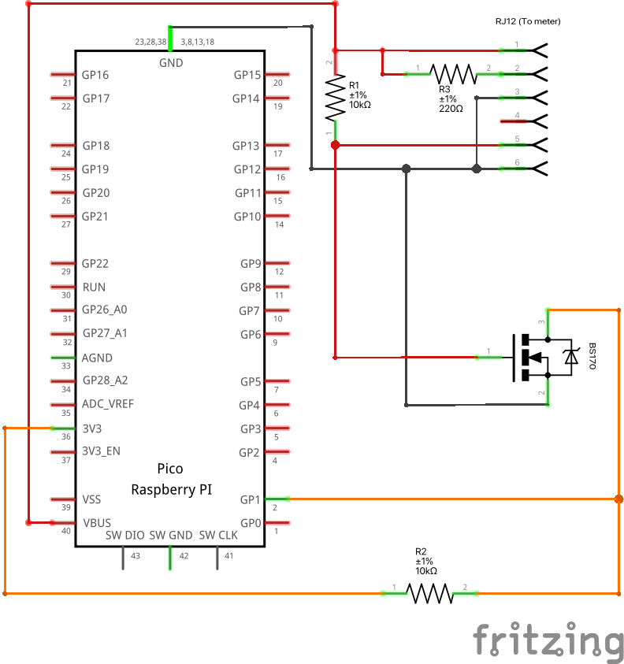
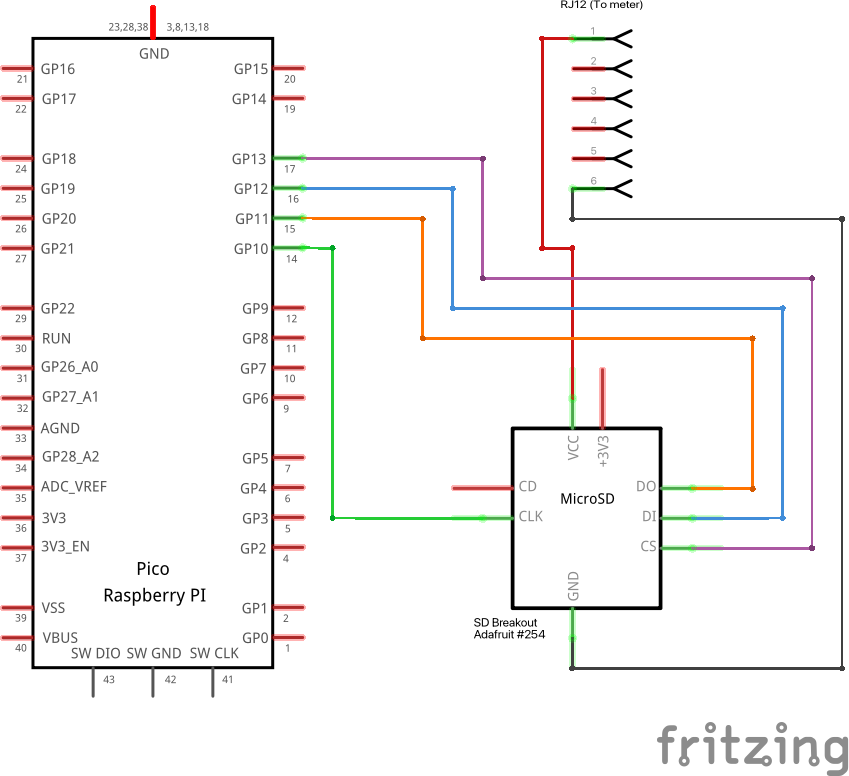
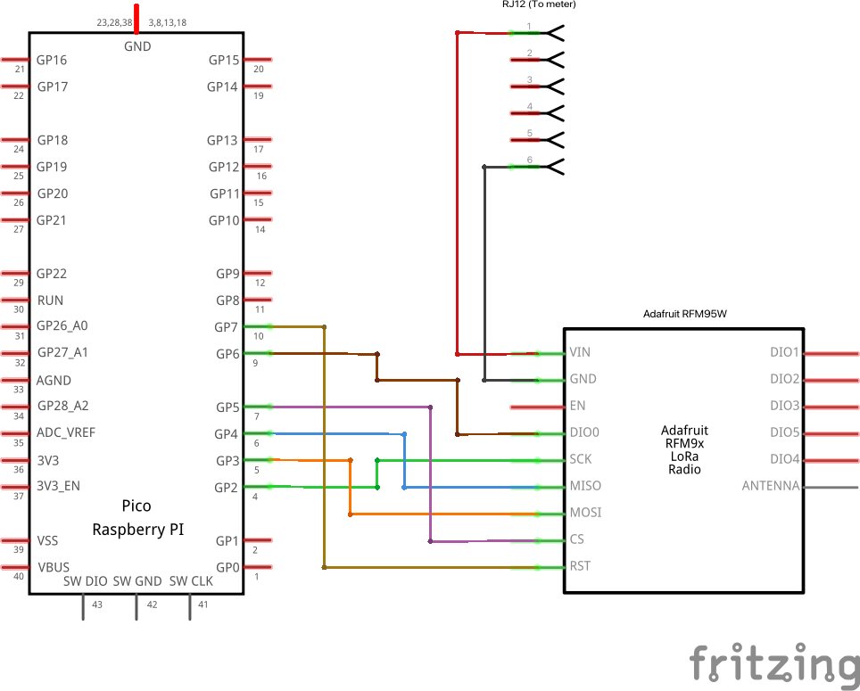
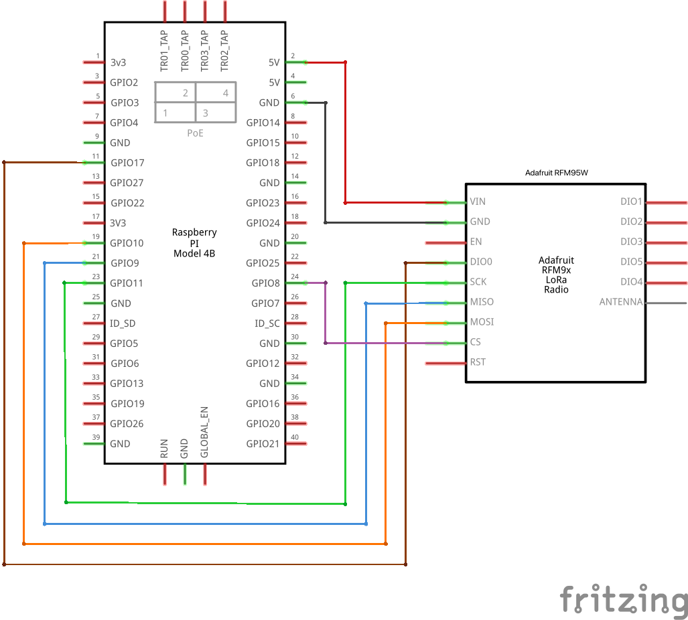

# LoRa DSMR Bridge

During the summer Fluvius replaced my old electricity meter with a new [Sagemcom S211](https://www.sagemcom.com/sites/default/files/datasheet/Datasheet%20T211_1121.pdf) smart meter. This enabled me to monitor my electricity consumption in real-time, which is very useful with the introduction of the quarter-hourly peak consumption based net tariffs.

The S211 has a DSMR5 P1 port which emits a telegram ~every second with detailed power and gas (and soon water) consumption data. Unfortunately, my meter is located in the (concrete) basement of an appartement building where there is no reception, which ruled out the commercially available P1 readers as they require some form of internet access (WiFi, Ethernet, ...). I opted to build something around a Raspberry Pi Pico and LoRa for communication.

A DSMR5 P1 port provides up to 250 mA @ 5 V which can easily power a Raspberry Pi Pico, leaving some room for LoRa and storage. The setup is made up of a sender and a receiver. The sender plugs into the P1 port, reads the telegrams, stores them on a SD card, re-encodes them, and then transmits them upstairs with LoRa. The receiver decodes the telegrams and submits them to a [DSMR Reader](https://github.com/dsmrreader/dsmr-reader) instance which processes and visualises the data.

## Hardware

The sender (which connects to the smart meter) is made up of the following parts:

* [Raspberry Pi Pico](https://opencircuit.nl/product/raspberry-pi-pico?cl=8B5D53U29M)
* [Adafruit 254](https://opencircuit.nl/product/breakout-board-voor-microsd-kaart-meer?cl=8B5D53U29M) - SD Card breakout
* [Adafruit RFM95W](https://thepihut.com/products/adafruit-rfm95w-lora-radio-transceiver-breakout-868-or-915-mhz) - LoRa transceiver
* [RJ12 cable](https://opencircuit.nl/product/rj12-6p6c-telefoonkabel-30cm?cl=8B5D53U29M) to connect to the meter
* [RJ12 connector](https://opencircuit.nl/product/sparkfun-rj11-6-pins-connector?cl=8B5D53U29M) on a [breakout](https://opencircuit.nl/product/sparkfun-rj11-breakout-2-stuks?cl=8B5D53U29M)
* [BS170 N-Channel MOSFET](https://opencircuit.nl/product/bs170-mosfet-n-channel-5-stuks?cl=8B5D53U29M)
* a couple [resistors](https://opencircuit.nl/product/weerstanden-set-1-procent-600-stuks-30-waardes?cl=8B5D53U29M) (1 x 220Ω, 2 x 1kΩ)
* some coloured multi-strand wire or an old UTP cable

The receiver is made up of a single RFM95W module which connects to an existing Raspberry Pi 4B, which also runs the DSMR Reader application.

Both cases are 3D prints and consist of multiple parts that screw together, you can find the STLs on [GitHub](https://github.com/martijnc/lora-dsmr-bridge/tree/main/STL) or [Thingiverse](https://www.thingiverse.com/thing:5577337). I used these screws:

* 2 x DIN7380 M3 x 5 mm for the RJ11 breakout
* 4 x DIN7985 M2 x 5 mm for the SD card breakout
* 4 x DIN7985 M2 x 8 mm for the RFM95W (sender)
* 2 x DIN7985 M2 x 5 mm for the Pico
* 4 x DIN912 M4 x 8 mm for the lid of the sender
* 4 x DIN7985 M2 x 5 mm for the RFM95W (receiver)
* 4 x DIN912 M2 x 5 mm for the lid of the receiver

### Wiring diagrams

#### RJ12 port
 
The RJ12 port connects to the meter and provides power to the sender. The DSMR data signal is a "8N1" serial connection with a baudrate of 115200 (item 5 of [P1 Companion Standard](https://www.netbeheernederland.nl/_upload/Files/Slimme_meter_15_a727fce1f1.pdf)). The P1 port is galvanically isolated from the mains through optocouplers which means the data signal is inverted. The signal has to be inverted again before being fed to a UART RX port on the Pico. This is where the MOSFET comes in.

| Pin number | Description |
| ---------- | ----------- |
| 1          | +5V |
| 2          | Data request - set high to start receiving data |
| 3          | Data ground |
| 4          | - |
| 5          | (Inverted) Data |
| 6          | Power ground  |

The meter provides power to the Pico; the RJ12 +5V (pin 1) and ground (pin 6) connect to VBUS (pin 40) and ground (any ground pin will work) respectively on the Pico.

Resistor R3 sets the data request pin high (connects pin 1 and pin 2). This tells the meter to start sending data. 

The BS170 MOSFET and resistors R1 and R3 act as an inverted for the data line (pin 5). They also convert the 5 V data signal down to a 3.3 V signal for the Pico's UART0 RX port (pin 2).

#### SD Card breakout

The SD Card breakout connects to the Pico's SPI1 interface. It is powered directly from the RJ12, it has an onboard voltage regulator which converts the 5 V to 3.3 V.

| RPi Pico Pin | SD Breakout Pin | Description |
| ------------ | --------------- | ----------- |
| - | VCC | Power is provided by the RJ12 directly |
| - | GND | Ground is provided by the RJ12 directly |
| 15 (GPIO #11) | DO | SPI1 TX (MOSI) |
| 16 (GPIO #12) | DI | SPI1 RX (MISO) |
| 17 (GPIO #13) | CS | SPI1 CSn |
| 14 (GPIO #10) | CLK | SPI1 SCK |

#### LoRa RFM95W breakout

##### Sender

The RFM95W connects to Pico's SPI0 interface. The breakout requires 3.3 V but is powered directly from the RJ12, it has an onboard voltage regulator as well.

| RPi Pico Pin | RFM95W Pin | Description |
| ------------ | ------------ | ----------- |
| - | VIN | Power is provided by the RJ12 directly |
| - | GND | Ground is provided by the RJ12 directly |
| 10 (GPIO #7) | DIO0 |  |
| 4 (GPIO #2) | SCK | SPI0 SCK |
| 6 (GPIO #4) | MISO | SPI0 RX (MISO) |
| 5 (GPIO #3) | MOSI | SPI0 TX (MOSI) |
| 7 (GPIO #5) | CS | SPI0 CSn |
| 10 (GPIO #7) | RST |  |

##### Receiver

On the receiver, a Raspberry Pi 4B, the RFM95W is connected to the SPI0 interface.

| RPi 4B Pin | RFM95W Pin | Description |
| ---------- | ------------ | ----------- |
| 2 | VIN | Provides 5 Volt to the breakout |
| 6 | GND | Ground for the breakout (any ground pin will work) |
| 24 (GPIO #8) | DIO0 |  |
| 23 (GPIO #11) | SCK | SPI0 SCLK |
| 21 (GPIO #9) | MISO | SPI0 MISO |
| 19 (GPIO #10) | MOSI | SPI0 MOSI |
| 24 | CS | SPI0 CE0 |

## Software

A DSMR5 telegram for the single phase S211 (a T211 polyphase meter has more fields) is around 500-550 bytes in size. It is not feasible to transmit a raw telegram with LoRa because of the limited bandwidth. By using a binary format rather than ascii only sending the values that change, the message size can be reduced significantly. I was able to get it down to 21 bytes without losing accuracy.

The reduction is a result of the following:

* the S211 is a single phase meter limiting the number of instantaneous value fields (each phase has 3, plus an extra field once there is more than 1 phase);
* I'm only interested in my energy consumption, thus about half the DSMR fields are not of interest and are omitted;
* I don't have solar panels so the power injection fields are omitted as well;
* information about the meter itself is omitted as it will not change without replacing the meter itself;
* the fields are encoded as unsigned integers rather than strings, each field has its own fixed bit length based on the expected range of values;
  * field values are multiplied by a fixed number based on the field accuracy to allow the encoding as an integer without losing the accuracy;
* the number and order of the fields is fixed, removing the need for most of the syntax, the field names, and the units.

The flow of a telegram is as follows:

* the Pico receives a DSMR5 telegram and verifies the checksum;
* the raw telegram is saved on the SD card;
* if the checksum matches, the telegram is parsed and the requested values (see below) are read;
* these values are re-encoded in a new binary format (see below);
* the new message is transmitted over LoRa;
* the receiver receives the message and verifies the length and checksum;
* if both match; the message is decoded;
* a DSMR5 telegram is reconstructed by merging the received values into a DSMR template (containing the other fields);
* the reconstructed telegram is submitted to the DSMR Reader API.

### Message format

The message is a string of unsigned integers encoded on a variable number of bits depending on the requirements of each field. A message contains the following DSMR values, in order:

| Field | Length (bits) | Description | Range & Unit |
| ----- | ------------- | ----------- | ------------ |
| Preamble | 8 | Fixed preamble | - |
| 0-0:1.0.0 | 17 | Timestamp of the telegram | 0 - 131071 s |
| 1-0:1.8.1 | 23 | Electricity consumption (Tariff 1) | 0.000 - 8388.607 kWh |
| 1-0:1.8.2 | 23 | Electricity consumption (Tariff 2) | 0.000 - 8388.607 kWh |
| 0-0:96.14.0 | 1 | Tariff indicator | 0 or 1 |
| 1-0:1.7.0 | 15 | Actual electricity power consumption | 0.000 - 32.767 kWh |
| 1-0:32.7.0 | 12 | Instantaneous voltage L1 | 0.0 - 409.5 V |
| 1-0:31.7.0 | 13 | Instantaneous current L1 | 0.00  - 81.91 A |
| 0-1:24.2.3 (time) | 17 | Timestamp of the last gas meter reading | 0 - 131071 s |
| 0-1:24.2.3 (value) | 22 | Gas volume | 0.000 - 4194.303 m³ |
| Checksum | 16 | CRC16 checksum | - |

#### Preamble

The preamble is a fixed 8 bit number to help identify messages from the sender. It allows the receiver to filter out most unrelated messages.

#### Timestamp (0-0:1.0.0)

The timestamp represents the number of seconds since last UTC midnight, similar to the Unix Epoch, which represents time as the number of seconds since UTC midnight on 1 January 1970. Because our timestamp only needs at most 86.400 unique values (the number of seconds in a day) it can be encoded on 17 bits.

To cope with clock differences between sender and receiver, the receiver treats small values (i.e. early in the day) at the end of the day (after 20:00) as timestamps for the next day.  Similarly, large values (i.e. late in the day) just after midnight (before 04:00) are assumed to be timestamps from yesterday.

#### Consumption (1-0:1.8.1 & 1-0:1.8.2)

The S211 smart meter reports two consumption values; one for consumption during weekdays and one for consumption during the nights and weekends. Both values are encoded on 23 bits. The consumptions counters have an accuracy of 1 Watt; this results in a range of 0.000 to 8388.607 kWh. For an average household this should suffice for at least a couple of years at which point the 0 value can be mapped to 8000 kWh giving a new range of 8000.000 to 16,388.607 kWh.

#### Tariff indicator (0-0:96.14.0)

The tariff indicator is a flag that indicates which tariff is currently active (see previous item). This can be encoded on a single bit.

#### Actual consumption (1-0:1.7.0)

The previous consumption values contain the total consumption, the meter also reports the instantaneous consumption; the amount of energy that is being consumed at this moment. The S211 is a single phase meter so the amount of energy that can be delivered is limited (for me the maximum is 9.2 kWh). The value is encoded on 15 bits which yields a range that is more than sufficient.

This field is also used as 1-0.21.7.0 (instantaneous power L1) because the S211 is a single phase meter.

#### Instantaneous voltage (1-0:32.7.0)

Similarly to the previous field, the meter als report the instantaneous voltage on the installation. In Europe a normal household installation runs on ~240 V. The value has on accuracy of 0.1 Volt giving a range of 0.0 V to 409.5 V when encoded on 12 bits. This should be sufficient, and if it is not, the overflowing of this field probably won't be the biggest problem :).

#### Instantaneous current (1-0:31.7.0)

The meter also reports the instantaneous current on the installation. This field has an accuracy of 0.01 A, encoding it on 13 bits results in a range of 0.01 A to 81.91 A. This is sufficient for a single phase installation as those cannot exceed 40 A.

#### Gas timestamp (0-1:24.2.3)

The smart gas meter communicates gas consumption to the smart electricity meter which in turn includes it in the DSMR telegrams (as will the new smart water meter!). The gas meter sends the total amount of gas consumed to the meter every 5 minutes through M-Bus. Because this value is only updates every 5 minutes, it has its own timestamp. The timestamp is encoded on 17 bits as well using the same method described earlier.

#### Gas consumption (0-1:24.2.3)

Gas consumption is reported in cubic metres. The field represents the total consumption since the installation of the meter. The field has an accuracy of 0.001 m³ and is encoded on 22 bits giving a range of 0.001 to 4,194.303 m³. This should last an average household a couple of years as well.

#### Checksum

The final 16 bits contain a CRC16 checksum (similar to the DSMR5 telegram) over the rest of the message.

### LoRa RF regulations

The devices use LoRa on the EU868 band to communicate. Bandwidth is set to 250 kHz with a spreading factor of 7 and code rate of 1 (4/5). A 21 byte (excluding the LoRa preamble and headers) message needs 30.34 ms on air time. With a 1% duty cycle limit on the EU868 band a message can be send every ~3 seconds. The current implementation sends a message at most once every 20 seconds (0,15% duty cycle).

EU regulations also limit the transmitting power in the EU868 band to 14 dBi. The sender transmits with 5 dBi TX power + 3 dBi antenna gain, so within regulatory limits.
